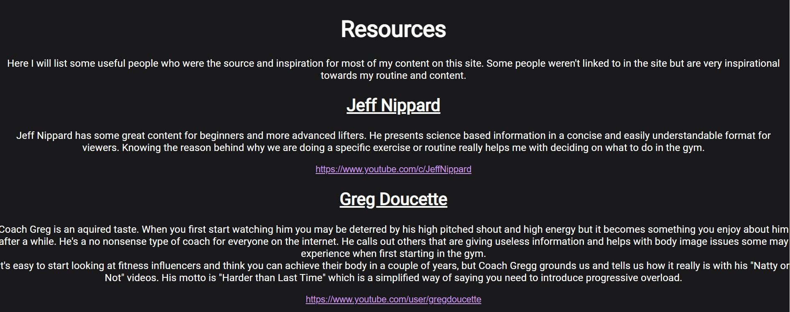

# Beginner Barbell
Beginner Barbell is a site that hopes to help newcomers to the gym with their journey to reach their fitness goals. The site will be targeted towards complete beginners who want to gain strength and muscle but don’t know where to start. The site will be useful to beginners who don’t want to be overwhelmed with information and just get the foundation of starting in the gym.

# Features 
## Navigation bar
The nav bar contains links to the home page, and all 5 other pages on the site. The logo also sits on the left hand side of the nav bar. This will allow the user to easily navigate across all pages on the site without having to contantly use a back button or search through their history.
## Exercise Library
The Exercise Library contains links to videos showing how to do each of the exercises spoken about in the site.

# Home Page
The home page is centered around an image telling the user to just get started in their journey with a brief description of what we hope to achieve.

# Routine Page
The routine page gives a breakdown of some key techniques to employ when weight training as well as a schedule and list of exercises to do on each day. We are following a Push,Pull,Legs routine.
This is a very common and well researched training routine.

# Nutrition Page
The nutrition page gives the user some basic nutritional and suppliment information. The goal is to show the user the foundation for giving their body what they need when they start weight training. This is supposed to be a simplified guide and doesn't go too in-depth into nutrition as the amount of information out there on this topic can be overwhelming.

# Rep Range Page
The rep range page shows the user a way to calculate what kind of weight they should be lifting and how many repitions they should do for each. Again, this is a simplified version as there are lots of studies and an abundance of information on this topic, but I boil it down to the main points.

# Resource Page
In the resource page I list all the people that influenced the website or people who I learned from when starting out with my own journey in th gym. I feel like it is important for me to give the user the ability to look further into the information for themselves.
Where I compiled as much information as I could for the user, I didn't want it to be overwhelming as they are only at the beginning of their journey. Here they can take themselves as far as they want to go with outside sources.

# Testing

## Validator Testing
Errors were initially found when passing through the validator for HTML. There were some unclosed tags and the header tag was initially outside the body tag.
No Errors were found passing though the jigsaw CSS validator

# Deployment
# Credits
## Embedded videos
The videos that were embedded in the Library page were taken directly from youtube's embedd code on each video.
## Content
I wrote the content from my head but each person who influenced this was linked in the "Resources" page.
## Media
The photo used on the home page are from an open source site called Pexels.com.
The logo is an icon found on open source site https://thenounproject.com/