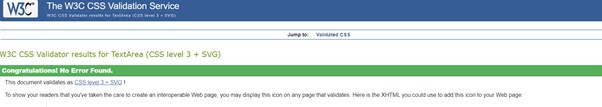

# Beginner Barbell
Beginner Barbell is a site that hopes to help newcomers to the gym with their journey to reach their fitness goals. The site will be targeted towards complete beginners who want to gain strength and muscle but don’t know where to start. The site will be useful to beginners who don’t want to be overwhelmed with information and just get the foundation of starting in the gym.

# Features 
## Navigation bar
The nav bar contains links to the home page, and all 5 other pages on the site. The logo also sits on the left hand side of the nav bar. This will allow the user to easily navigate across all pages on the site without having to contantly use a back button or search through their history.
## Exercise Library
The Exercise Library contains links to videos showing how to do each of the exercises spoken about in the site.

# Home Page
The home page is centered around an image telling the user to just get started in their journey with a brief description of what we hope to achieve.

# Routine Page

# Nutrition Page

# Rep Range Page

# Resource Page

# Testing

## Validator Testing
Errors were initially found when passing through the validator for HTML. There were some unclosed tags and the header tag was initially outside the body tag.
No Errors were found passing though the jigsaw CSS validator

# Deployment
# Credits
## Embedded videos
The videos that were embedded in the Library page were taken directly from youtube's embedd code on each video.
## Content
I wrote the content from my head but each person who influenced this was linked in the "Resources" page.
## Media
The photo used on the home page are from an open source site called Pexels.com.
The logo is an icon found on open source site https://thenounproject.com/